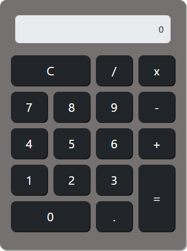

# Calculadora
Calculadora simples desenvolvida utilizando o paradigma de Programação Orientada a Objetos (POO).

## 🚀 Tecnologias Utilizadas

Esse projeto foi desenvolvido com as seguintes tecnologias:

 **HTML** para a estruturação da página  
 **CSS** para o design e estilo visual  
 **JavaScript** para a interatividade e funcionalidades  
 **Bootstrap** para o layout responsivo e componentes rápidos

### 🛠️ Ferramentas

- **Editor de código**: Visual Studio Code
- **Controle de versão**: Git & GitHub

---

## 🌐 Link do Projeto

Acesse o projeto clicando no link abaixo:

[🌐 **Calculadora POO**](https://brunog-code.github.io/calculadora/)

---

## 📸 Visualização

Aqui está um exemplo de como a calculadora se apresenta:

---

